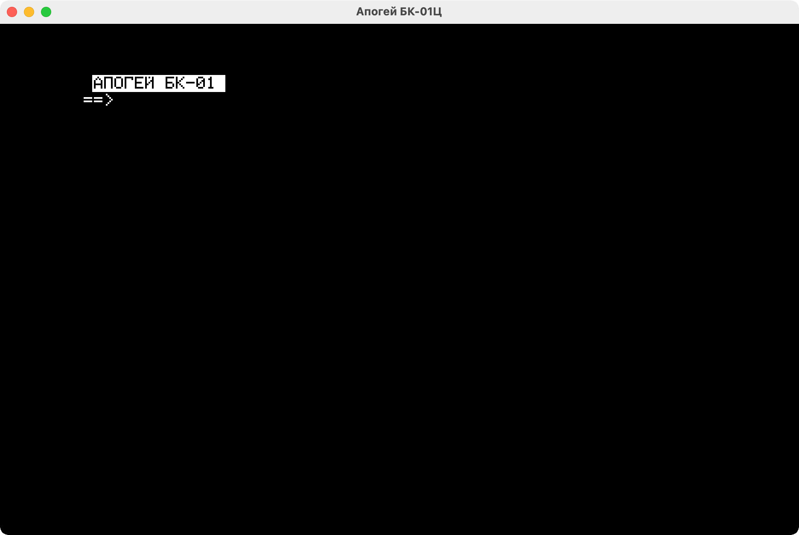

<div align="center"><a href="https://github.com/coignard/apogee">
  <picture>
    <source srcset="https://github.com/coignard/apogee/blob/main/assets/apogee.png?raw=true">
    
  </picture>
</a>

Apogee BK-01 emulator with MIDI support via PPI

[](https://github.com/coignard/apogee/actions)
[](https://github.com/coignard/apogee/security/code-scanning)
[](https://crates.io/crates/apogee-rs)
[](LICENSE)
[](https://ko-fi.com/coignard)

<picture>
  <source srcset="https://github.com/coignard/apogee/blob/main/assets/apogee.gif?raw=true">
  
</picture>

</div>

## The why

This project is a reasonably accurate emulation of the Soviet 8-bit home computer Apogee BK-01 and its components from the KR580 microprocessor family: namely the VG75 programmable CRT controller, VI53 programmable interval timer, VT57 programmable DMA controller, and VV55A programmable peripheral interface, all of which are exact copies of the Intel 8275, 8253, 8257, and 8255A respectively. CPU emulation is provided by the [iz80](https://github.com/ivanizag/iz80) library, into which corrections were made to match the VM80A (Intel 8080) specification precisely. Since iz80 is instruction-accurate, there is no true cycle-accuracy in this project in the purist sense of the word, despite the precise modelling of the behaviour of all the main components.

This project set out to give a great machine a second life, and a musical one at that. I had been working mostly in live coding before, but decided that working with church organs called for something more serious, and so resolved to turn to, that is, offline assembling. To that end I equipped the emulator with MIDI via VV55A and the [Apogee SDK](https://github.com/coignard/apogee-sdk) for flat assembler g, which includes VM80A assembler definitions and other things useful for development. Since the aim was accuracy in MIDI timing and minimising jitter, the synchronisation mechanism is tied to the sound card clock: a deliberate compromise, due to which video stuttering may occur on weaker hardware, but the emulation stream itself will remain smooth.

<a href="https://coignard.bandcamp.com/album/acts-of-god">**Hear it in action ▶**</a>

## Install

To download the source code, build the Apogee binary, and install it in `$HOME/.cargo/bin` in one go run:

```bash
cargo install --locked --git https://github.com/coignard/apogee
```

You can also install the latest release directly from [crates.io](https://crates.io/crates/apogee-rs):

```bash
cargo install apogee-rs
```

Or install via Homebrew:

```bash
brew install coignard/tap/apogee
```

Alternatively, you can manually download the source code and build the Apogee binary with:

```bash
git clone https://github.com/coignard/apogee
cd apogee
cargo build --release
sudo cp target/release/apogee /usr/local/bin/
```

## Install as library

Add the following to your `Cargo.toml`:

```toml
[dependencies]
apogee-rs = "0.3.2"
```

## Test

```bash
cargo test
```

Tests use a replay-based snapshot system. Each file in `tests/replays/` is a JSON recording of a session: input events, timing, and metadata (ROM name, sample rate, display settings, SHA-256 of the ROM).

The emulator replays the events and at each checkpoint compares machine state and screenshot against the expected dumps in `tests/dumps/`.

To update snapshots after an intentional change:

```bash
UPDATE_SNAPSHOTS=1 cargo test
```

Please note that changes to [iz80](https://github.com/coignard/iz80) that affect instruction timing or CPU state require manually reviewing and rerecording the affected replays, not just regenerating snapshots.

## Credits

Thanks to Kakos Nonos for sharing his Apogee BK-01 programs used in the test suite, [Victor A. Pykhonin](https://github.com/vpyk) for helping debug checksums and KR580VI53 and for [emu80](https://github.com/vpyk/emu80v4) which was the main reference for this emulator, and Olga Podivilova for the Apogee BK-01 illustration.

## Sponsors

<a href="https://cloud9.sh/">
  <picture>
    <source media="(prefers-color-scheme: dark)" srcset="https://github.com/cloud9-hq/assets/blob/main/logos/logo-dark.svg?raw=true">
    <source media="(prefers-color-scheme: light)" srcset="https://github.com/cloud9-hq/assets/blob/main/logos/logo.svg?raw=true">
    
  </picture>
</a>

## License

The Apogee source code is © 2026 René Coignard and licensed under the [GNU General Public License v3.0 or later](LICENSE).

The [Apogee SDK](https://github.com/coignard/apogee-sdk) source code is © 2026 René Coignard and licensed under the [zlib License](https://github.com/coignard/apogee-sdk/blob/main/LICENSE).

The [flat assembler g](https://github.com/coignard/fasmg) source code is © 2015-2025 Tomasz Grysztar and licensed under the [BSD 3-Clause License](https://github.com/coignard/fasmg/blob/master/core/license.txt).

The `.rka` files in `tests/assets/` are Apogee BK-01 programs written by and © Kakos Nonos, included with his kind permission. Some programs may contain third-party assets whose rights belong to their respective owners. `proverka.rka` is included for testing purposes; its authorship and copyright status are unknown. If you are the copyright holder and object to its inclusion, please [open an issue](https://github.com/coignard/apogee/issues).

<picture>
  <source srcset="https://github.com/coignard/apogee/blob/main/assets/stamp.svg?raw=true">
  
</picture>
