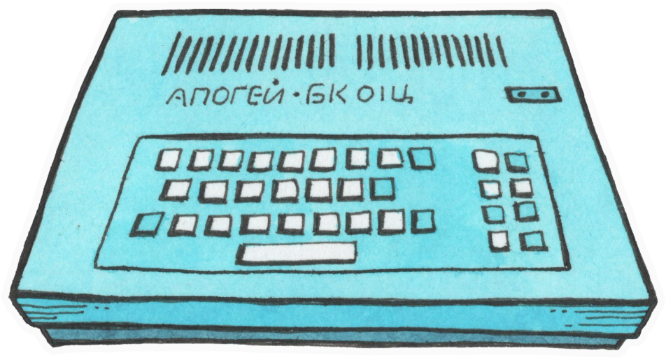

<a href="https://github.com/coignard/apogee">
  <picture>
    <source srcset="https://github.com/coignard/apogee/blob/main/assets/apogee.png?raw=true">
    
  </picture>
</a>

Apogee BK-01 emulator with MIDI support via PPI

